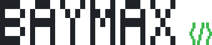

<h1><samp>Ammar&nbsp;Malik&nbsp;Awan</samp></h1>

<samp>
BSCS Freshman @ FAST NUCES &nbsp;·&nbsp; Islamabad, PK &nbsp;<code>UTC+5</code> 
<b>v0.1.0</b> &nbsp;-&nbsp; in active development
</samp>

---

 

- `status` &nbsp;- First-year Computer Science student, learning to build software properly rather than quickly.
- `focus` &nbsp;- Python and C++. Syntax first, then data structures and algorithms.
- `here` &nbsp;- A public workspace, not a portfolio. Everything is in progress on purpose.
- `next` &nbsp;- Shipping something small, real, and deployed that isn't a tutorial.
- `open` &nbsp;- To collaboration, and to being told what I'm doing wrong.

 

---

 

  

<samp>Fork anything. Just tell me what you built with it.</samp>

